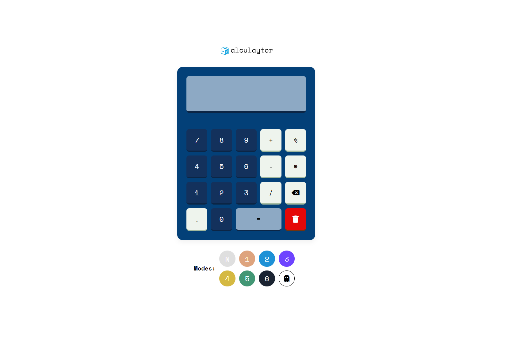

#  alculaytor

A simple minimal calculator with 7 different colour modes to choose from

## Screenshot

## Process

The process behind the project is based on simple iterations and mistakes that i made and was bailed out using some simple youtube videos.
BUT the design was first done using figma, link would be included at the end of the project readme. I really enjoyed working on this project
cause it gave me the freedom to work around my fears and use my own intelligence to improve.

figma - [!Figma Link](https://www.figma.com/file/vXyEOe2lxSHVhCViQQEwGG/Calculator?node-id=0%3A1&t=c30d1jXFZ0meSO8X-1)